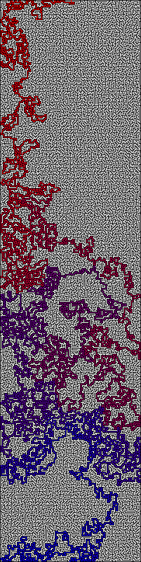
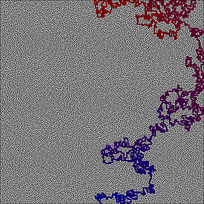
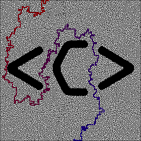

# Pathfinding Algorithms with Mazes

### <u>Current Working Algorithms:</u>

- A* optimised
  - As opposed to brute forcing each available path the program finds nodes

  - This can reduce total working area by a significant amount

  - 4k x 4k (16 million pixels) Mazes with multiple solutions can take under a minute to solve on basic hardware

  - It is not optimised to work with multiple threads

####  Special thanks to [MikePound](https://github.com/mikepound/mazesolving), I used a few of his mazes and ideas from [Computerphile](https://www.youtube.com/watch?v=rop0W4QDOUI) to get going!
### Demonstration  

## Maze (41x41)

## Finding nodes:

## Solved:

#### Additional Solved mazes can be found in the solved folder

- Notes:
  - Larger mazes example
  - 4 million pixel width
  - 
  - Trimmed to nearly 600k (~85% reduction) 
  - Node discovery is approx 75k/s (on an older laptop, yet to test on others)
  - Started at ~12.5k/s initally (500% increase)

## Additonal mazes:
#### 400x100

#### 200x200

#### Computerphile

